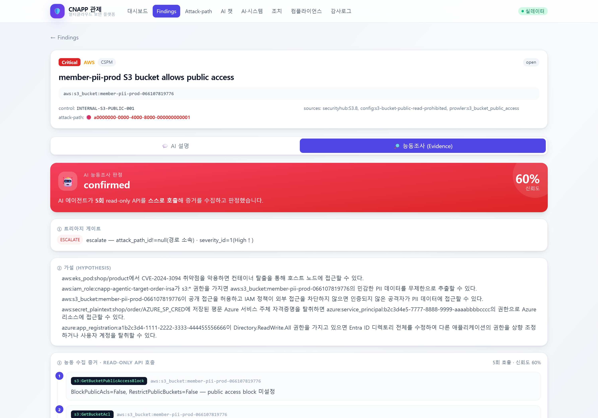
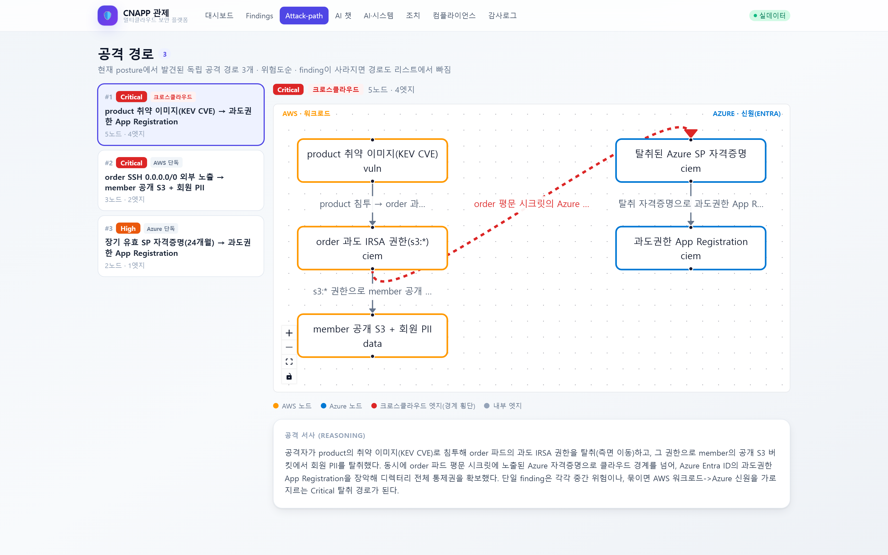

# 에이전틱 AI 기반 멀티클라우드 CNAPP 보안 플랫폼

> 멀티클라우드(**AWS = 워크로드의 주인 / Azure = 신원의 주인(Entra ID)**) 환경의 설정부터 워크로드·IaC 코드까지 **code-to-cloud 보안 위험을 점검·통합·상관분석**하고, 그 위에 **에이전틱 AI(Amazon Bedrock + RAG)**로 발견 항목을 설명·우선순위화·자동 개선하는 CNAPP형 보안 플랫폼.
>
> 클라우드 보안 엔지니어 포트폴리오 목적의 **2인 협업 프로젝트**입니다.
>
> **현재 단계: 전 레이어 실배포·실검증 완료.** AWS+Azure 멀티클라우드에 실제로 배포해 — 스캐너(kube-bench·Trivy·Prowler AWS/Azure·IAM Access Analyzer)가 실 계정·실 클러스터를 read-only로 스캔하고, 에이전틱 엔진이 **실 Bedrock으로 read-only API를 스스로 호출해 능동 조사·판정**하며, 관제 콘솔이 커스텀 도메인(`cnapp-agentic.cloud`)에서 **SSO 실 로그인**으로 동작하고, HITL 조치가 **실 Step Functions로 실행**되는 것까지 검증했다. 비용 규율상 상시 가동이 아니라 **apply→검증→destroy 사이클**로 운영한다.

### 🖥️ 실행 화면



> **이 프로젝트의 핵심 장면.** Bedrock이 `s3:GetBucketPublicAccessBlock` 등 **read-only API를 스스로 골라 5회 호출**해 실제 버킷 상태(`BlockPublicAcls=False, RestrictPublicBuckets=False`)를 확인하고 **confirmed** 판정을 냈다. 위에서부터 트리아지 게이트(승급 사유) → 가설 → 실 API 호출 증거 순으로, **판정에 이른 경로가 전부 남는다.** 규칙이 정한 API를 실행한 게 아니라 LLM이 조사 도구를 선택했다는 점이 "챗봇 탈출"의 기준.



> 관제 콘솔의 attack-path 화면. 현재 posture에서 발견된 **독립 공격 경로 3개**를 위험도순으로 세우고, 선택한 경로를 AWS(워크로드)·Azure(신원) 레인으로 나눠 그린다. **빨간 점선이 클라우드 경계를 넘는 엣지** — `order` 파드의 평문 시크릿에서 얻은 Azure 자격증명으로 Entra ID를 장악하는 구간이다. 개별로는 중간 위험인 finding들이 묶여 Critical 경로가 되는 지점이 CNAPP의 핵심.
>
> 화면 데이터는 전부 실 RDS 값이다. 다른 화면(대시보드·RAG 챗·ArgoCD GitOps 등)과 **각 이미지가 무엇을 증명하는지·어떻게 재현하는지**는 [`screenshots/README.md`](screenshots/README.md) 참조.

### 📊 실측 검증 수치

| 항목 | 실측값 |
|---|---|
| 인프라 풀사이클 | Terraform **6레이어 · 리소스 207개** apply → 검증 → destroy (잔존 비용 0) |
| 실 취약점 탐지 | Trivy가 실 ECR 이미지에서 **CVE 205개** · kube-bench가 CIS 4.1.1(cluster-admin 과다바인딩) 실탐지 |
| 에이전틱 능동조사 | Bedrock이 read-only API를 **스스로 선택·호출**해 공개 S3 조사 → **CONFIRMED (confidence 100%)** |
| 조사 권한 경계 | **AWS 9종 + Azure MS Graph 3종** allowlist, 스키마 enum + 실행 직전 2겹 강제 |
| 운영 관측 | CloudWatch **24위젯** · 알람 7종 · **X-Ray 5개 Lambda** 분산추적 · Grafana 4소스 통합 |
| 회귀 게이트 | 계약 4-assert + 컴포넌트 **9종 `run_demo`** + `run_e2e` — 전부 통과해야 병합 |

### ⚡ 30초 만에 직접 확인하기 (AWS 계정 불필요)

핵심 주장은 **클라우드 자원 없이 로컬에서 바로 검증**할 수 있다. 계약 목업 데이터로 전 파이프라인이 실제로 도는지 확인하는 경로:

```bash
python contracts/validate.py   # 계약 정합 4-assert (스키마·control 카탈로그·case 교차검증)
python run_e2e.py              # 스캐너 → 정규화 → 상관(attack-path) → 엔진 → RAG 전 구간 관통
```

둘 다 **순수 stdlib라 설치가 필요 없고**, 매 PR마다 GitHub Actions(`ci.yml`)가 이 둘 + 컴포넌트 9종 `run_demo`를 **하드 게이트**로 돌린다 — 하나라도 exit ≠ 0이면 병합이 막힌다.

### 📂 이 레포는 무엇인가 / docs 안내

설계의 단일 진실 공급원(SSOT)은 `docs/` 폴더이며, 각 문서의 역할은 다음과 같다.

| 문서 | 무엇인지 |
|---|---|
| [docs/project-draft.md](docs/project-draft.md) | **전체 설계서(SSOT)** — 방향·범위·핵심 결정(D1~D19)·아키텍처·로드맵·미확정 항목 총괄. 여기부터 읽는다. |
| [docs/target-app-design.md](docs/target-app-design.md) | **타깃 앱 설계도** — 일부러 취약하게 만드는 워크로드(findings 소스). 기능 베이스(retail-store)·의도적 결함 목록(f1~f8)·골든 attack-path + §7 구현 청사진(결함↔IaC 토글 매핑). |
| [docs/console-app-design.md](docs/console-app-design.md) | **관제 앱 설계도** — 우리가 만드는 보안 관제 플랫폼. 화면·백엔드·RBAC·RAG↔UI 매핑 + §15 구현 청사진(스택·API 표면·화면↔mock). |
| [docs/console-manual.md](docs/console-manual.md) | 📖 **관제 콘솔 사용 매뉴얼** — "무엇을 보고 무엇을 누르나". 화면별 기능·AI 동작·데모 시연 동선·FAQ. **앱 파악용 첫 문서.** |
| [docs/manual-infra.md](docs/manual-infra.md) | **수동 관리 리소스 현황** — 콘솔/CLI로 직접 설정한 리소스(계정 초기화·Terraform 부트스트랩·Azure SSO 등). Terraform 관리 대상 제외. |
| [docs/cost-strategy.md](docs/cost-strategy.md) | 💰 **비용 최적화 전략** — 프로덕션급 아키텍처를 저비용으로 증명한 FinOps 결정 원장(mock-first·경량 대체·모델 티어링·destroy 규율 + 정직한 트레이드오프). |
| [portfolio/cnapp-agentic_PPT_구성안.md](portfolio/cnapp-agentic_PPT_구성안.md) | 🎞️ **포트폴리오 PPT 구성안** — 발표/PDF 포폴 슬라이드 설계(20장). |
| [CLAUDE.md](CLAUDE.md) | **작업 기준·협업 규칙 + 변경 로그** — 위 설계서들의 요약 + 협업 규칙. 상세 변경 이력. |

---

## 🔑 핵심 키워드

- **Multi-Cloud** — AWS(워크로드의 주인)와 Azure(신원의 주인, Entra ID)의 흩어진 보안 상태를 OCSF-lite로 정규화해 단일 뷰로 통합하고, **AWS 워크로드 침해가 Azure 신원 장악으로 번지는** 클라우드 경계를 넘는 위험 경로를 추적한다. *(데이터 중복 저장은 명분이 약해, 데이터·PII는 AWS S3에만 둔다.)*
- **CNAPP (6기둥)** — CSPM(설정)·CIEM(권한)·취약점(CVE)·KSPM(쿠버네티스)·DSPM(데이터)·attack-path(상관)를 하나의 그래프로 묶어, 단일 도구로는 못 잡는 **독성 조합(toxic combination)**을 탐지한다.
- **Agentic AI** — 질문해야 답하는 챗봇이 아니라, 에이전트가 **read-only API를 스스로 호출(tool use)**해 실제 클라우드 상태를 조사하고 가설→증거→판정 루프로 위험을 추론한다. ("챗봇 탈출의 단일 기준 = LLM이 스스로 API를 호출해 증거를 모으는가.")

---

## ✨ 주요 기능

- **6기둥 CNAPP 점검(실동작)** — CSPM(Config·Security Hub·Prowler·Macie)·CIEM(IAM Access Analyzer·Entra Prowler)·취약점(Trivy)·KSPM(kube-bench)·DSPM(Macie)·attack-path(커스텀 상관 엔진 R1~R5)를 실 계정·실 클러스터에서 스캔.
- **에이전틱 AI 능동 조사** — Orchestrator→Triage→Hypothesis→Evidence→Reasoning 5단계 루프. Evidence 단계의 Bedrock이 계약으로 고정된 read-only allowlist(**AWS 9종 + Azure MS Graph 3종**) 안에서 **스스로 도구를 골라 호출**해 `GetBucketPolicy`·`GetPublicAccessBlock` 등으로 실 S3를 조사하고 CONFIRMED 판정까지 실증. 변경 API는 allowlist에 아예 없고, 조치는 분리된 HITL 경로에서만 실행된다.
- **크로스클라우드 attack-path** — "AWS 취약 워크로드 침투(product KEV 이미지) → 과도 IRSA 측면이동 + **평문 시크릿에서 Azure 자격증명 발견** → 공개 S3의 PII 탈취 → **탈취 자격증명으로 Entra ID 과도권한 앱 장악**"처럼, 개별로는 중간 위험인 finding들을 하나의 신원 탈취 경로로 엮는다. 3단계 이상 체인은 severity를 Critical로 자동 격상. *(MVP는 분석·시각화 수준, 실제 횡단 익스플로잇은 범위 밖.)*
- **RAG 기반 설명·챗봇** — Titan Embed v2(1024-dim) → pgvector cosine 검색(HNSW) → Bedrock이 근거 청크로만 답변(할루시네이션 억제). finding 상세 설명 탭 + `/chat` AI 어시스턴트.
- **HITL 자동 개선(실증)** — 에이전트는 기본 read-only. 변경(remediation)은 approver 승인 → **Step Functions 실행** → finding remediated → Secure Score 상승. 모든 조치는 **S3 Object Lock 불변 감사로그**로 기록(실측: terraform drift 0).
- **Shift-Left CI 게이트 + 플랫폼 자기방어** — PR 단계에서 Checkov(IaC)·Trivy(이미지) 검사 + 회귀 10종 하드 게이트. 플랫폼 자체는 CloudFront **WAF**(실 XSS 차단 확인)·JWT 서명검증·전구간 TLS·키리스 인증으로 하드닝.

---

## 🏗️ 아키텍처 개요

```
[ 입력: CNAPP 신호 (계정을 read-only로 스캔 · agentless) ]
  AWS 설정/워크로드 :  Config · Security Hub · Prowler · Trivy · kube-bench · IAM Access Analyzer · Macie(S3 전용)
  AWS 빌드 게이트   :  CI에서 Checkov(IaC) · Trivy(이미지)
  Azure            :  Entra ID(CIEM: 과도권한 앱·위험한 consent) — Prowler entra_*  · *Defender for Cloud는 범위 제외(Azure 실 리소스 0개)*
        │  (ASFF / OCSF / trivy-json → OCSF-lite 정규화, resource_id 캐논화, dedup)
        ▼
  EventBridge → SQS(+DLQ) → λ ingest → λ normalize → RDS(findings)
        │  (2-pass 이벤트 구동)
  ┌──── 공유 에이전틱 엔진 (Bedrock Claude Haiku + RAG) ────┐
  │  Orchestrator → Triage → Hypothesis → Evidence → Reasoning │
  │  거버넌스: read-only first · allowlist 2중 강제 · 불변 감사로그 │
  └────────────────────────────────────────────────────────────┘
        │
  [ attack-path 그래프 ]  R1~R5 상관 → AWS 워크로드 → Azure 신원 크로스클라우드 탈취 경로
        │
  위험 → 조치 제안 → HITL(approver 승인) → Step Functions → S3 Object Lock 감사로그
        │
  [ 관제 앱 ]  Secure Score + findings + attack-path + AI 설명/조치  (React SPA · S3+CloudFront+WAF · Cognito SSO)
```

**연결 구조 (agentless):** 점검 대상인 타깃 앱은 클라우드 계정에 *배포*만 되고, 스캐너가 계정을 외부에서 **read-only로 스캔**한다. findings는 수집 파이프라인을 거쳐 정규화·저장되며, 관제 앱은 그 저장소를 읽어 표시한다. 타깃 앱과 관제 앱 사이의 직접 통신은 없다.

> 전체 아키텍처 다이어그램: [portfolio/cnapp-architecture-overview.drawio](portfolio/cnapp-architecture-overview.drawio)

---

## 🧰 기술 스택

| 영역 | 사용 기술 |
|---|---|
| **AWS 보안** | CloudTrail, Config, Security Hub, Prowler, IAM Access Analyzer, Macie(S3 민감데이터), CloudFront **WAF**(플랫폼 자기방어) |
| **Azure 보안** | Microsoft Entra ID(신원·CIEM 핵심, Prowler `entra_*`) — *데이터 저장소 아님 · Defender for Cloud는 범위 제외(실 리소스 0)* |
| **워크로드 / 배포** | EKS(1.34), ECR, **ArgoCD(GitOps CD)**, **Karpenter(spot·consolidation) · HPA**, IRSA |
| **CI/CD** | **GitHub Actions**(CI: 회귀 10종 + Shift-Left Trivy·Checkov) → **ArgoCD**(CD: GitOps pull-sync). 선언형 코드 = [`gitops/`](gitops/) |
| **에이전틱 AI** | Amazon Bedrock(Claude Haiku 4.5, Converse tool-use), 수동 RAG(Titan Embed v2), pgvector(RDS PostgreSQL 16) |
| **수집 / 오케스트레이션** | EventBridge, SQS(+DLQ), Lambda, Step Functions(HITL 조치), OCSF-lite 정규화 |
| **인증 / 거버넌스** | Microsoft Entra ID(IdP, SAML) → Cognito(OIDC/PKCE 허브) → SPA 직접 로그인, `aws-jwt-verify`(JWKS 서명검증), S3 Object Lock(불변 감사) |
| **관제 앱 (프론트)** | Vite + React + TypeScript, TanStack Query, Tailwind, React Flow(attack-path), Recharts, MSW(mock 하네스) |
| **관제 앱 (백엔드)** | TypeScript Lambda(ALB→Lambda, 읽기 API) — *폴리글랏: console=TS / engine·pipeline=Python* |
| **관측 / 호스팅** | S3 + CloudFront, kube-prometheus-stack(EKS) + CloudWatch(24위젯·알람 7종) + **X-Ray(5 Lambda 분산추적)** + Grafana(4소스 통합) + CloudTrail + Teams 알림(3채널) |
| **IaC** | Terraform(**레이어드 6층** — shared·karpenter·target·console·backend·monitoring) · `deploy.ps1`이 apply 정방향 / destroy 역방향 순서 강제 |

---

## 🏗️ 폴더 구조

```
cnapp-agentic/
├── CLAUDE.md                 작업 기준 · 협업 규칙 · 변경 로그(읽기 우선)
├── README.md
├── troubleshooting.md        작업 로그 (트러블슈팅 + 진행, [영역] 태그)
├── run_e2e.py                end-to-end 러너(스캐너→정규화→상관→엔진→RAG 한 줄 관통)
├── .github/workflows/        ci.yml(회귀 10종 + Trivy/Checkov) · build-images.yml · prowler-scan.yml · access-analyzer-scan.yml · live-health-canary.yml
├── gitops/                   CD(ArgoCD Application) + 오토스케일(Karpenter·HPA) + monitoring(Grafana 대시보드) 선언형
├── contracts/                ★공유 이음새 계약(7 JSON) + control-catalog(15종) + 골든 mock 3종 + validate.py(4-assert)
├── docs/                     설계 SSOT — project-draft · target/console-app-design · console-manual · manual-infra · cost-strategy
├── portfolio/                포폴 자산 — 아키텍처 drawio · PPT 구성안
├── apps/
│   ├── target/               취약 타깃 앱 (product · order · member[FastAPI] + PII seeder)
│   ├── console/              관제 앱 프론트 (Vite+React+TS · 9화면 · 실 RDS 라이브)
│   └── console-backend/      관제 앱 백엔드 (ALB→Lambda TS · 실 pgvector 쿼리)
├── engine/                   공유 에이전틱 엔진
│   ├── core/                 (공유) contracts · tools · case
│   ├── evidence/             (준형) triage · evidence · bedrock_planner — 능동조사
│   └── reasoning/            (진우) hypothesis · reasoning · orchestrator (+ 실 Bedrock 스왑판)
├── scanners/                 cspm(준형) / workload·ciem(진우) — 실 계정 라이브 관통
├── pipeline/                 ingest(준형) / normalize(진우) — 실 finding 흐름
├── rag/                      corpus(준형) / retrieval(진우) — Titan+pgvector+Bedrock
├── attackpath/               model(준형) / correlation(진우) — R1~R5 상관·2-pass
└── infra/                    Terraform (레이어드) — deploy.ps1로 순서 강제
    ├── shared/               VPC·NAT Instance·EKS·ECR·RDS pgvector·OIDC·IAM + db/schema.sql(7테이블)
    ├── karpenter/            동적 노드 오토스케일러(helm·IRSA·spot·NodePool)
    ├── target/               취약 워크로드 + 의도적 결함 IaC(토글)
    ├── console/              S3+CloudFront+WAF · ALB→Lambda · Cognito SSO · 커스텀 도메인
    ├── backend/              수집·정규화+상관·오케스트레이터 Lambda(2-pass) · remediation SFn · 감사 Object Lock
    └── monitoring/           운영 관측(진우) — Grafana IRSA · CloudWatch 24위젯 · X-Ray · CloudTrail · Teams

# 컴포넌트 폴더(scanners·pipeline·engine·rag·attackpath)는 코드만 — 배포는 infra/에서 apply.
# 폴더는 사람이 아니라 컴포넌트로 나눔(소유·이음새는 docs/project-draft §4.6).
```

---

## 👥 역할 분담 (2인 협업)

> 원칙 — 일을 나누되 **둘 다 상대 영역까지 이해**한다. 각 영역을 반으로 갈라 양쪽이 핵심을 다 만진다. 상시 협의로 조정되는 살아있는 분담이며, 상세 SSOT는 [CLAUDE.md §5](CLAUDE.md) · [project-draft §4.1](docs/project-draft.md).

| 영역 | 이준형 | 김진우 |
|---|---|---|
| **토대** | 앱(타깃+관제) 개발 · CI/CD · Shift-Left · 공유 인프라 주도 | 모니터링·관측(Grafana · X-Ray) |
| **스캐너 — CSPM** | CSPM(Config · Prowler · Security Hub · Macie) | 워크로드(Trivy · kube-bench) + Azure(Entra CIEM) |
| **스캐너 — CIEM** | IAM Access Analyzer(AWS) | Entra ID(Azure) |
| **수집 · 정규화** | 수집부(EventBridge → SQS) | 정규화부(Lambda → OCSF-lite) |
| **엔진 (Bedrock)** | Evidence(tool use) · Triage | Hypothesis · Reasoning · Orchestrator |
| **RAG** | 코퍼스 · 임베딩 · pgvector 적재 | 검색 · LLM 답변 생성 |
| **attack-path** | 그래프 데이터 모델 | 상관 로직(5개 규칙 체인) · 내러티브 |
| **인증 · SSO** | Cognito 허브 · 콘솔 SSO · 로그인 감사 | Entra 테넌트 · App Registration · SAML IdP |
| **조치 · 거버넌스** | 조치(Remediation · SFn · 감사) · 하드닝(WAF · JWT · TLS) | CloudTrail 감사 · 키리스 인증(Entra OIDC) |

> ⚠️ "관제"는 두 가지 — **관제 "앱"**(CNAPP 보안 대시보드 제품) = 준형 / **운영 "관측"**(Grafana·CloudTrail·X-Ray 플랫폼 관측) = 진우. 애플리케이션 2개(타깃·관제)는 모두 준형이 개발한다.
>
> **협업 방식** — 컴포넌트 이음새를 JSON 계약(7종)으로 **먼저 고정**하고, 각자 `contracts/mock-*.json`으로 병렬 개발한 뒤 `mock=False` 한 줄로 실 데이터로 스왑했다. CI Validate 게이트(4-assert)가 계약 정합을 강제 → 2인이 직렬 의존 없이 동시에 작업.

---

## 🚧 구현 현황 (Status)

> **전 영역 라이브 실검증 완료.** 아래는 각 영역이 실제로 어디까지 동작하는지.

| 영역 | 상태 |
|---|---|
| 📜 **공통 계약 (`contracts/`)** | ✅ 계약 7종 JSON + INTERNAL control 카탈로그(**15종**) + 골든 mock 3종. `validate.py` 4-assert + GitHub Actions CI 게이트로 정합 보장 |
| 🖥️ **관제 콘솔 (`apps/console`)** | ✅ **라이브 운영** — 커스텀 도메인(`cnapp-agentic.cloud`) · **SSO 실 로그인**(Entra SAML→Cognito) · 실 RDS 데이터 · **9화면**(대시보드·Findings·Finding상세[Evidence 능동조사 탭]·Attack-path·AI 챗[`/chat`]·System·컴플라이언스[ISMS-P]·조치[HITL]·감사) |
| 🛒 **타깃 앱 (`apps/target`)** | ✅ **ArgoCD로 실기동** — member/product/order Running(build-images.yml→ECR→ArgoCD Synced/Healthy). member(FastAPI) API 200 · PII seeder S3 적재(Macie 미끼). 모든 PII/시크릿 가짜, 결함 8종은 IaC에 의도적으로 심음 |
| 🧠 **에이전틱 엔진 (`engine/`)** | ✅ **실 Bedrock 능동조사** — Evidence가 실 Claude Haiku로 read-only API를 스스로 호출해 실 S3 조사 → CONFIRMED(100%). Hypothesis·Reasoning도 실 Bedrock 스왑 구현·검증(2026-07-10). allowlist 2중 강제(스키마 enum + 실행 직전 재확인) |
| 🔍 **스캐너 (`scanners/`)** | ✅ **실 계정 라이브 관통** — kube-bench(CIS 4.1.1 실탐지)·Trivy(실 CVE 205)·**Prowler AWS+Azure**(GitHub Actions 자동스캔→S3→ingest)·IAM Access Analyzer(외부신원 특정). Security Hub·Macie는 계정 구독제약이라 데모 직전 활성 |
| 📥 **수집 · 정규화 (`pipeline/`)** | ✅ **라이브 관통** — EventBridge→SQS→ingest→normalize Lambda→RDS. ASFF/OCSF/trivy-json/custom → OCSF-lite(resource_id 캐논·dedup). 2-pass 이벤트 구동 |
| 📚 **RAG (`rag/`)** | ✅ **라이브** — Titan Embed v2(1024-dim) **26청크·15 control 적재** → pgvector cosine(HNSW) → Bedrock 답변. `/chat`이 근거 청크(control_id)를 함께 반환하고, 엔진 판정에도 `rag_refs`가 실린다. 적재는 `python -m rag.corpus.load_live`(**재apply 때마다 필요** — `rag_chunks`는 RDS에 있어 destroy와 함께 사라짐) |
| 🕸️ **attack-path (`attackpath/`)** | ✅ R1~R5 상관 + 그래프 모델 · 2-pass backfill. 실 RDS 기준 재계산(골든 5노드 크로스클라우드 체인) |
| ⚡ **조치 (Remediation)** | ✅ **HITL 실증** — approver 승인 → `remediation_requests` INSERT → Step Functions `StartExecution` → finding remediated → Secure Score 상승. S3 Object Lock 불변 감사. terraform drift 0 |
| 🏗️ **인프라 (`infra/`)** | ✅ **라이브 풀사이클** — 레이어드 **6층 · 리소스 207개** apply→검증→destroy 반복 실증(`deploy.ps1`이 순서 강제, 잔존 0). VPC(NAT Instance)·EKS 1.34(Karpenter spot)·RDS PG16+pgvector(7테이블)·Lambda VPC 배치. 키리스(GitHub OIDC·IRSA) |
| 🔐 **거버넌스 · 하드닝** | ✅ CloudFront WAF(실 XSS 차단 확인) · JWT 서명검증(`aws-jwt-verify`) · 전구간 TLS · read-only first · 불변 감사(Object Lock) |
| 📊 **운영 관측 (`infra/monitoring`)** | ✅ **라이브** — Grafana(4소스: Prometheus·CloudWatch·PostgreSQL·X-Ray) · CloudWatch 24위젯·알람 7종 · X-Ray 5 Lambda 분산추적 · CloudTrail 연동 · Teams 알림 3채널 |
| ⚙️ **CI/CD (`.github/`·`gitops/`)** | ✅ CI(회귀 10종 + Trivy/Checkov Shift-Left) · 이미지빌드(OIDC 키리스→ECR) · ArgoCD GitOps · cron 자동스캔(Prowler·Access Analyzer)·라이브 헬스 캔어리 |

> **전략 = 계약·목업 우선.** 실제 스캐너/엔진을 기다리지 않고 `contracts/mock-*.json`으로 관제 콘솔·엔진을 끝까지 만든 뒤 실데이터로 교체 — 직렬 의존을 두 병렬 트랙으로 분리한 뒤, 전 영역을 실 클라우드로 관통시켰다.

---

## 📖 상세 설계

설계의 배경·결정 근거·로드맵 등 상세 내용은 상단 [📂 docs 안내](#-이-레포는-무엇인가--docs-안내) 표의 문서를 참고한다. (project-draft → target-app-design → console-app-design 순)

> 📌 상세 변경 이력은 [CLAUDE.md 변경 로그](CLAUDE.md#변경-로그-최신이-위로)와 [troubleshooting.md](troubleshooting.md)에서 관리한다(README는 현재 상태만 유지).
